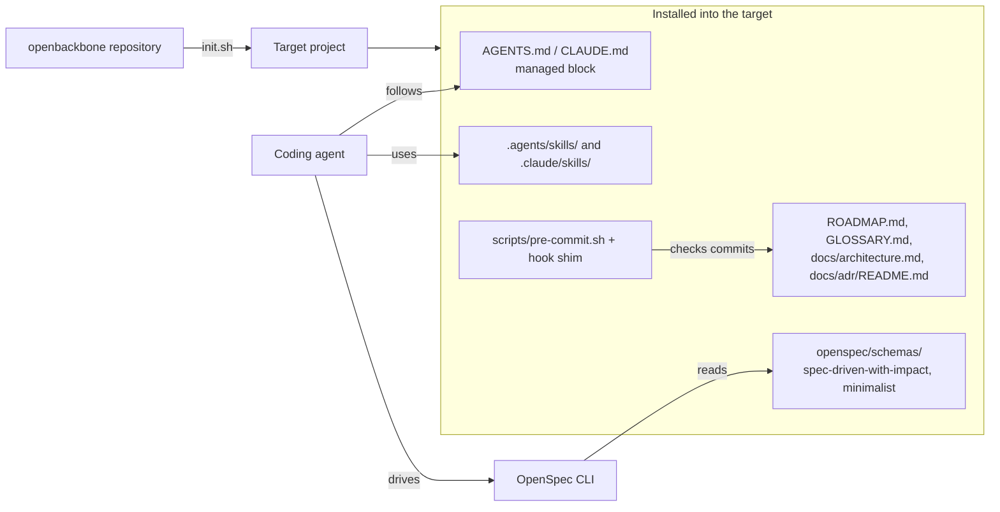
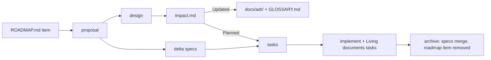

# Architecture

How openbackbone is put together today. Reasons are in the [ADRs](./adr/).

## Overview

openbackbone is a template repository plus one installer, reachable three ways: `npx openbackbone`, `curl | bash`, or a local clone. Nothing runs after installation except a Git hook and the OpenSpec CLI.

## Components

| Path | Responsibility | Ownership in the target |
|---|---|---|
| `init.sh` | Resolve the source, install selected components, write `.openbackbone.yaml` | Not installed |
| `package.json` | npm distribution; its `bin` is `init.sh`, so `npx openbackbone` runs the same installer | Not installed |
| `AGENTS.md` | The rules every agent follows; copied into a managed block | Managed block only |
| `openspec/schemas/spec-driven-with-impact/` | The five-artifact workflow and its instructions | Replaced on rerun |
| `openspec/schemas/minimalist/` | The light path for spikes | Replaced on rerun |
| `skills/` | `domain-modeling`, `openspec-git-discipline`, `tech-doc` | Replaced on rerun |
| `templates/` | Starting points for roadmap, glossary, architecture | Seeded once, then the project's |
| `docs/adr/README.md` | The ADR rules | Replaced on rerun |
| `scripts/pre-commit.sh` | The discipline checks | Replaced on rerun |

The OpenSpec workflow skills (`openspec-propose`, `openspec-apply-change`, and so on) are generated by `openspec init`, not shipped from this repository.

## How a change flows

## What the hook enforces

Only what can be checked mechanically: existing ADRs are unchanged, a new ADR has no Requirement or Scenario sections, a staged `impact.md` has an entry in all five sections, and `openspec validate --all --strict` passes. Whether specs use glossary terms, and whether an ADR really passes the three tests, is left to the schema instructions and the `domain-modeling` skill.

The hook shim is written only inside the repository's own hook directory. A `core.hooksPath` that points elsewhere is left alone and the component is reported as skipped.
