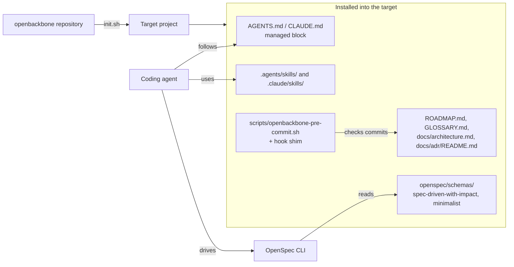
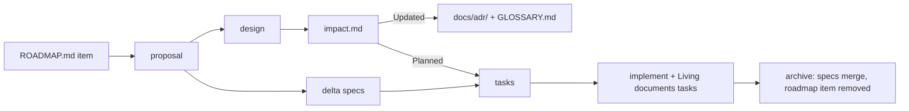

# Architecture

How openbackbone is put together today. Reasons are in the [ADRs](./adr/).

## Overview

openbackbone is a template repository plus one installer, run through `curl | bash` or from a local clone. Nothing runs after installation except a Git hook and the OpenSpec CLI.

## Components

| Path | Responsibility | Ownership in the target |
|---|---|---|
| `init.sh` | Resolve the source, install selected components, write `.openbackbone.yaml` | Not installed |
| `package.json` | Package manifest for a future npm release; its `bin` is `init.sh`. Not published | Not installed |
| `AGENTS.md` | The rules every agent follows; copied into a managed block | Managed block |
| `openspec/schemas/spec-driven-with-impact/` | The five-artifact workflow and its instructions | Managed by marker |
| `openspec/schemas/minimalist/` | The light path for spikes | Managed by marker |
| `skills/` | `domain-modeling`, `openspec-git-discipline`, `tech-doc` | Managed by marker |
| `docs/adr/README.md` | The ADR rules | Managed by marker |
| `scripts/openbackbone-pre-commit.sh` | The hook's checks | Replaced on rerun |
| `templates/` | Starting points for roadmap, glossary, architecture | Seeded once |

## Ownership in the target

The installer never overwrites what a project already had. Each installed path is one of four kinds:

| Kind | Rule on a rerun |
|---|---|
| Managed block | Only the text between the `openbackbone` markers in `AGENTS.md` and `CLAUDE.md` is replaced. The file is rewritten in place, so a symlink and its permissions survive |
| Managed by marker | Replaced only while the file carries its ownership marker (`managed-by: openbackbone`). A same-named file without the marker is the project's: it is kept and reported |
| Replaced on rerun | The hook's checks and the shim, under names a project does not use |
| Seeded once | Created if missing, then never touched |

`openspec/config.yaml` is the project's. The installer changes one line of it, the default schema, and only when that is unset or still OpenSpec's stock `spec-driven`.

`scripts/regression-test.sh` and `scripts/e2e-test.sh` verify the installer and hook against a stubbed CLI and the schemas against the real one; neither is installed.

The OpenSpec workflow skills (`openspec-propose`, `openspec-apply-change`, and so on) are generated by `openspec init`, not shipped from this repository.

## How a change flows

## What the hook enforces

Only what can be checked mechanically, and only in what the commit touches. State that was in the repository before never fails a commit.

- ADRs already on the default branch are unchanged (a draft on the current branch can be revised);
- a new or revised ADR has no `Requirement:` or `Scenario:` headings;
- a staged `impact.md` has an entry in all five sections;
- staged specs are valid, and so is every staged change that has delta specs (earlier artifacts can be committed on their own);
- a change archived by the commit has no open tasks, which is what keeps the "Living documents" tasks from being skipped.

Whether specs use glossary terms, and whether an ADR really passes the three tests, is left to the schema instructions and the `domain-modeling` skill.

The hook shim is written only inside the repository's own hook directory. A `core.hooksPath` that points elsewhere is left alone and the component is reported as skipped.
